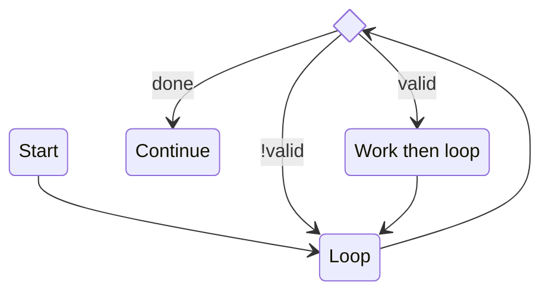
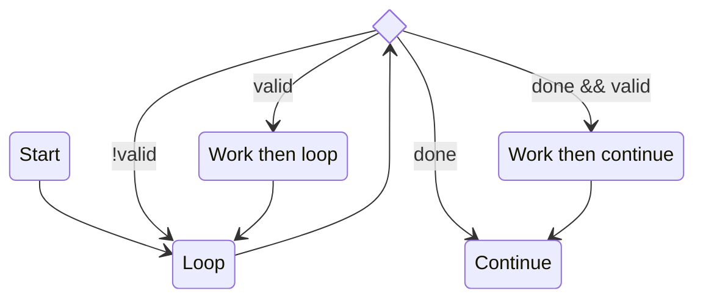
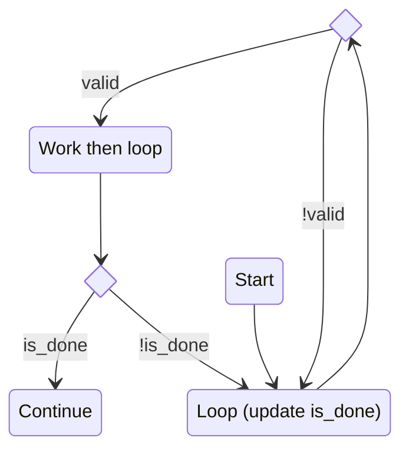

# For Loop Limitation

With the addition of function call support, modules can no longer have `valid` and `done` both be set in the same cycle. That is, `done` must be set after the last valid output cycle. Why is this?

Users for the `for .. in ...:` construct currently do not support the "rememberance of done", at each iteration of the for loop. As an example, with the following Python Code:

```python
instance = generator_creator(a, b, c)
...
# start
for out0, out1 in instance:
    # work
    pass
# continue
```

The generated FSM for is as follows:



Notice that there is no explicit transition for the case where `done && valid`.

One way to solve this is by adding an additional state:



This duplicates the "work" logic.

Alternatively, a flag can be added:



Both of these options add complexity and solutions must be carefully considered. This is particularily for nested `for` loops.
